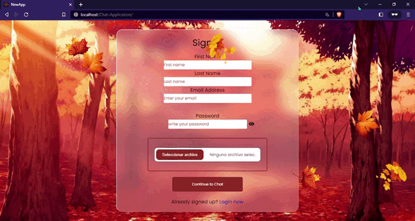
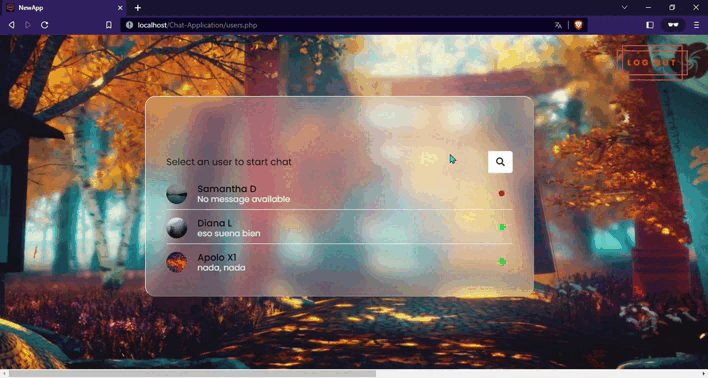

  
  

## Introduction
Web application to chat with your friends, inspired in https://youtu.be/VnvzxGWiK54

## Technologies used
Technologies used: HTML, CSS, JavaScript, PHP, MySQL.

## Setup and Requirements
- XAMMP or WampServer (any other)

## Project Structure
    chat/
    ├── css/
    │   ├── chat.css
    │   ├── index.css
    │   ├── login.css
    │   └── users.css
    ├── img/
    │   └── ...
    ├── js/
    │   ├── chat.js
    │   ├── login.js
    │   ├── pass-show-hide.js
    │   ├── signup.js
    │   └── users.js
    ├── php/
    │   ├── images/
    │   ├── config.php
    │   ├── data.php
    │   ├── get-chat.php
    │   ├── insert-chat.php
    │   ├── login.php
    │   ├── loguot.php
    │   ├── search.php
    │   ├── signup.php
    │   └── users.php
    ├── chat.php
    ├── chat-app.sql
    ├── index.php
    ├── login.php
    ├── README.md
    ├── unzippers.php
    └── users.php

## Installation and Execution
- run the sql code in xampp or other environment
- go to the browser and type "localhost/Chat-Web/index.php"
